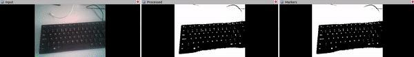

# iMarker Detector ROS (with Rviz)



Welcome to the **iMarker Detector ROS** repository 💡!
This project provides a **ROS-1 wrapper for iMarker Detection** for revealing and detecting **iMarkers** placed in the environment.
The software has also a **standalone version** with GUI, available in [this link](https://github.com/snt-arg/iMarker_detector_standalone).
To achieve the functionalities of the project, this tool integrates the following submodules:

- 🔌 [iMarker Sensor Interfaces](https://github.com/snt-arg/iMarker_sensors) — capture and stream data from various camera setups
- 👁️ [iMarker Detection Algorithms](https://github.com/snt-arg/iMarker_algorithms) — core image processing and marker extraction logic

## 🧠 About iMarkers

**iMarkers** are invisible fiducial markers detectable only by certain sensors and algorithms. They enable robust detection for human-robot interaction, AR applications, and indoor localization.
Read more about iMarkers (developed for the TRANSCEND project at the [University of Luxembourg](https://www.uni.lu/en/)) in [this link](https://snt-arg.github.io/iMarkers/).

## 🛠️ Getting Started

This section will guide you through setting up the **iMarker Detector ROS** with all necessary submodules and dependencies.

### I. Create a ROS 2 Workspace and Clone the Repository with Submodules

First, create a new ROS 2 workspace and clone the repository into it:

```bash
mkdir -p ~/ros2_ws/src
cd ~/ros2_ws/src
```

Clone the repository along with its submodules ([sensor interfaces](https://github.com/snt-arg/iMarker_sensors) and [detector algorithms](https://github.com/snt-arg/iMarker_algorithms)) in the `src` directory of the workspace using:

```bash
git clone --recurse-submodules git@github.com:snt-arg/iMarker_detector_ros.git
```

> 🛎️ Tip: If you have already cloned it without `--recurse-submodules`, you can initialize and update the submodules afterward:

```bash
git submodule update --init --recursive
```

### II. Environment Setup & Installation

We recommend using `Python>=3.10.4` and a virtual environment to avoid package conflicts.

#### 1. Create and activate a virtual environment:

```bash
python -m venv .venv
source .venv/bin/activate  # On Windows use `.venv\Scripts\activate`
```

#### 2. Install Dependencies:

```bash
pip install -r requirements.txt
```

#### 3. Build the Catkin Package:

Finally, return to the root of your workspace and build using `colcon`:

```bash
colcon build --symlink-install
```

## 🚀 Running the Code

### I. Configure the Application

Before launching the application, you need to adjust the configuration settings to match your sensor setup and detection preferences.

- The main configuration file is located at [`config/config.yaml`](./config/) repository, where you can find various configuration files for different sensors.
- For detailed explanations of each parameter, refer to the [configuration guide](./config/README.md).

| Configuration                                      | Description                              |
| -------------------------------------------------- | ---------------------------------------- |
| [`cfg_dual_usb.yaml`](/config/cfg_dual_usb.yaml)   | Dual-vision USB camera setup             |
| [`cfg_dual_ids.yaml`](/config/cfg_dual_ids.yaml)   | Dual-vision iDS camera setup             |
| [`cfg_single_off.yaml`](/config/cfg_off.yaml)      | Single-vision offline `rosbag` file mode |
| [`cfg_single_rs.yaml`](/config/cfg_single_rs.yaml) | Single-vision RealSense camera setup     |

> 🛎️ Tip: The configuration is automatically parsed and applied when launching the application.

## II. Run the Desired Mode

When everything is ready, you can source the workspace and run one of the launch files listed below:

| Launcher                                                                                | Description                             |
| --------------------------------------------------------------------------------------- | --------------------------------------- |
| [`imarker_detector_dual_usb.launch.py`](/launch/imarker_detector_dual_usb.launch.py)    | runs the dual-vision USB camera setup   |
| [`imarker_detector_dual_ids.launch.py`](/launch/imarker_detector_dual_ids.launch.py)    | runs the dual-vision iDS camera setup   |
| [`imarker_detector_single_off.launch.py`](launch/imarker_detector_single_off.launch.py) | runs the single-vision offline `rosbag` |
| [`imarker_detector_single_rs.launch.py`](/launch/imarker_detector_single_rs.launch.py)  | runs the single-vision RealSense setup  |

Once the configuration is set, navigate to the project root and launch one of the launch files:

```bash
# Source the workspace
source ~/[workspace]/install/setup.bash

# Activate the .venv
source ~/[workspace]/src/imarker_detector_ros/.venv/bin/activate

# Launch the desired launch file
ros2 launch imarker_detector_ros imarker_detector_[x].launch.py
# Or directly run the Python files
# ros2 run imarker_detector_ros src/[file-name].py
```

The script will automatically launch the appropriate runner based on your selected mode.

## 🤖 ROS Topics and Parameters

### Subscribed Topics

| Topic                     | Description                                                                   |
| ------------------------- | ----------------------------------------------------------------------------- |
| `/camera/color/image_raw` | for offline mode, modifiable in `sensor`/`offline`/`rosbag`/`raw_image_topic` |

### Published Topics

| Topic               | Description                                                  |
| ------------------- | ------------------------------------------------------------ |
| `/raw_img`          | publishes the main camera output of the mono-vision setup    |
| `/raw_img_left`     | publishes the left camera output of the double-vision setup  |
| `/raw_img_right`    | publishes the right camera output of the double-vision setup |
| `/mask_img`         | publishes the genetated mask to detect CSRs/iMarkers         |
| `/mask_applied_img` | publishes the genetated mask applied to the raw image        |
| `/marker_img`       | publishes the detected iMarker information                   |
| `/rs_cam_params`    | publishes the camera parameters of RealSense                 |

## 🔩 ArUco Marker Recognition

By default, the ArUco marker recognition library is built-in in all setups, processing `/mask_img` and publishing to `/marker_img`.

However, you can also run `aruco_ros` library (ROS-1 branch) [link](https://github.com/pal-robotics/aruco_ros) separately and feed it with `/mask_img` and `/rs_cam_params` topic. For doing this, you should follow below steps:

- Create a separate `launch` file for `aruco_ros` library. It should remap `/mask_img` and `/rs_camera_params` of the repository with `/image` and `/camera_info` topics of `aruco_ros`, respectively. A sample can be found [here](docs/aruco_ros_imarker.launch).
- Run the program using `roslaunch imarker_detector_ros iMarker_detector_rs.launch`

## 📎 Related Repositories

It is intended to work in conjunction with the core detection and visualization pipelines:

- 🔌 [iMarker Sensor Interfaces](https://github.com/snt-arg/iMarker_sensors)
- 👁️ [iMarker Detector Algorithms](https://github.com/snt-arg/iMarker_algorithms)
- 🤖 [GUI-enabled Version of iMarker Detection for Advanced Robotics](https://github.com/snt-arg/iMarker_detector_standalone)

## 📚 Citation

```bibtex
@article{tourani2025unveiling,
  title={Unveiling the Potential of iMarkers: Invisible Fiducial Markers for Advanced Robotics},
  author={Tourani, Ali and Avsar, Deniz Isinsu and Bavle, Hriday and Sanchez-Lopez, Jose Luis and Lagerwall, Jan and Voos, Holger},
  journal={arXiv preprint arXiv:2501.15505},
  year={2025}
}
```
