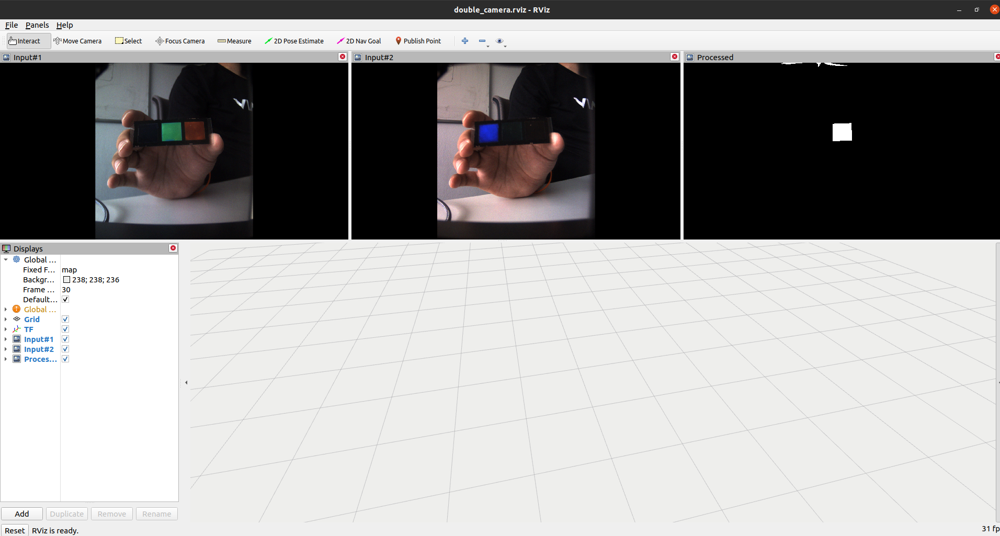

# CSR Detector ROS (with Rviz)



This repository contains the ROS version of CSR-based object detector which provides a wrapper over [csr_sensors](https://github.com/snt-arg/csr_sensors) and [csr_detector](https://github.com/snt-arg/csr_detector) and provides an Rviz user interface for monitoring the results. Accordingly, the application is dependant to the repositories below:

## 📚 Preparation

### I. Cloning

Create a new workspace and clone the repo in its `src` folder. This repo has some submodules which have been added using the command `git submodule add git@[repo].git src/[name]`. When cloning the repository include `--recurse-submodules` after `git clone` such that the submodules are added as well. Accordingly, you can use the command below:

```
git clone --recurse-submodules git@github.com:snt-arg/csr_detector_ros.git
```

You can also get the latest changes of each submodule individually using the command `git pull --recurse-submodules`. After cloning the repository, you can add a command like `alias sourcecsr='source ~/workspace/ros/csr_detector_ros_ws/devel/setup.bash'` in your `.bashrc` file.

### II. Installing Libraries

Install the required Python libraries for running this program using the command below:

```
pip install numpy opencv-python
```

### III. Installing Submodule Packages

The next step is to intall the cloned submodules and define dependencies and other distribution-related configurations using the provided `setup.py` file in the root directory. Then, run `pip install -e .` in the **root directory** to install the package and its dependencies. You can also run the same command in the submodules directories to install them.

### IV. Build Catkin Package

Finally, when everything has been installed, you can run `catkin build` to build the files.

## 🚀 Running the Code

When everything is ready, you can source the workspace (running `sourcecsr` as described before) and run one of the nodes listed below:

| Launcher | Description |
| ------------ | ------------ |
| `csr_detector_usb.launch` | Runs the USB cameras version of the code |
| `csr_detector_ids.launch` | Runs the iDS cameras version of the code |
| `csr_detector_rs.launch` | Runs the RealSense camera version of the code |

There are also some arguments that you can configure based on your scenario:

- `show_rviz`: Runs an Rviz node when running the main node (default: true)

For instance, the below command runs the RealSense version of CSR detector while not running Rviz:

```
roslaunch csr_detector_ros csr_detector_rs.launch show_rviz:=false
```

## 🤖 ROS Topics and Params

### Subscribed topics

| Topic | Description |
| ------------ | ------------ |
| `-` | N/A |

### Published topics

| Topic | Description |
| ------------ | ------------ |
| `/left_camera` | Publishes the left camera of a two-camera setup |
| `/right_camera` | Publishes the right camera of a two-camera setup |
| `/main_camera` | Publishes the main camera of a mono-camera setup |
| `/result_frame` | Publishes the resulting frame after processing |
| `/result_mask` | Publishes the resulting frame mask after processing |

### Params

| Param | Description |
| ------------ | ------------ |
| `-` | N/A |